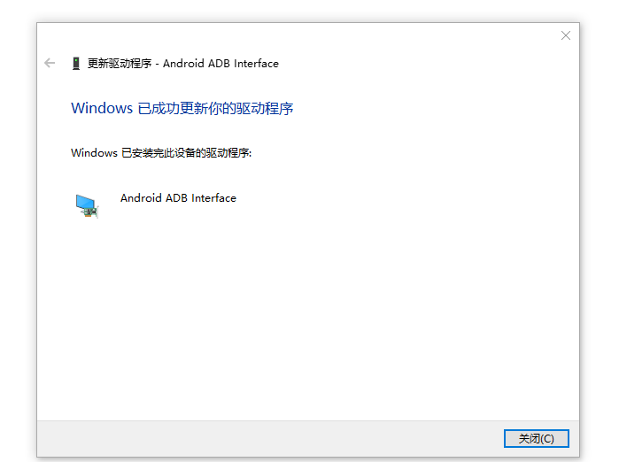

# **[kali nethunter](https://www.kali.org/get-kali/#kali-mobile)**

准备

 `Google USB 驱动` 

> https://developer.android.com/studio/run/win-usb?hl=zh-cn
>
>  `usb_driver-windows.zip` 

 `Android SDK Platform-Tools` 

> https://source.android.com/docs/setup/build/adb?hl=zh-cn#download-adb
>
>  `platform-tools-windows.zip` 

 `LineageOS` 

> https://download.lineageos.org/changes
>
>  `recovery.img` 
>
>  `boot.img` 
>
>  `lineage-nightly-monet-signed.zip` 

 `Google apps` 

> https://wiki.lineageos.org/gapps
>
>  `MindTheGapps-arm64.zip ` 

 `Magisk` 

> https://magisk.me/zip/
>
>  `Magisk.apk` 
>
>  `Magisk.zip`

 `TeamWin - TWRP` 

> https://twrp.me/
>
>  `me.twrp.twrpapp.apk` 
>
>  `twrp-monet.img` 

`nethunter`

> https://www.kali.org/get-kali/#kali-mobile
>
>  `nethunter-generic-arm64-kalifs-full.zip` 

## 解锁

在 `关于手机` 中点击多次 `版本号` ，启动 `开发者选项`

进入 `开发者选项` ，开启 `OEM 解锁`  ，开启 `USB 调试` 

手机关机状态下，同时按住音量下键和电源键进入 `fastboot` ，连接电脑

打开 `cmd` ，检测设备

> 手机上勾选一律允许使用这台计算机进行调试

```powershell
D:\Downloads\platform-tools_r34.0.5-windows\platform-tools>.\fastboot.exe devices
```

> 没有检测到设备

找到在 `设备管理器` 中找到 `其他设备` 下名为 `Android` 的异常设备

右键异常驱动，`更新驱动程序` ，`浏览我的电脑以查找驱动程序` 

`让我从电脑上的可用驱动程序列表中选择` ，`下一步` ， `从磁盘安装` ，`浏览` 选中

>  `Google USB` 驱动
>
> D:\Downloads\usb_driver_r13-windows\usb_driver\android_winusb.inf

`打开` ， `确定` 

选中 `Android ADB Interface` ，点击 `下一步` ，点击 `是` 

勾选 `始终信任来自 "Google LLC" 的软件` ，点击 `安装`  

显示 `Windows 已成功更新你的驱动程序` ，点击 `关闭` 



再次检测设备

```powershell
D:\Downloads\platform-tools_r34.0.5-windows\platform-tools>.\fastboot.exe devices
b65b7917         fastboot
```

> 成功检测到设备

解锁 `bootloader`

```powershell
D:\Downloads\platform-tools_r34.0.5-windows\platform-tools>.\fastboot.exe oem unlock
OKAY [  3.227s]
Finished. Total time: 0.122s
```

> 手机确认 `Unlock the bootloader` 即可解锁

## 刷机

解锁后，连接电脑进入 `fastboot` 

```powershell
D:\Downloads\platform-tools_r34.0.5-windows\platform-tools>.\adb.exe reboot bootloader
```

刷入 `boot` 

```powershell
D:\Downloads\platform-tools_r34.0.5-windows\platform-tools>.\fastboot.exe flash boot D:\Downloads\boot.img
Sending 'boot' (131072 KB)                         OKAY [  3.246s]
Writing 'boot'                                     OKAY [  0.548s]
Finished. Total time: 3.807s
```

刷入 `recovery` 

```powershell
D:\Downloads\platform-tools_r34.0.5-windows\platform-tools>.\fastboot.exe flash recovery D:\Downloads\recovery.img
Sending 'recovery' (131072 KB)                     OKAY [  3.253s]
Writing 'recovery'                                 OKAY [  0.538s]
Finished. Total time: 3.810s
```

进入 `recovery` 

```powershell
D:\Downloads\platform-tools_r34.0.5-windows\platform-tools>.\fastboot.exe reboot-recovery
Rebooting into recovery                            OKAY [  0.004s]
Finished. Total time: 0.004s
```

进入 `recovery` 后使用音量键上下选择，电源键确认

进入 `Factory reset` ，进入 `Format data/factory reset` 

选择 `Format data` ，确认即可清除数据

回到主页，进入 `Apply update` 选择 `Apply from ADB` 

刷入 `LineageOS`

```powershell
D:\Downloads\platform-tools_r34.0.5-windows\platform-tools>.\adb.exe sideload D:\Downloads\lineage-19.1-20231010-nightly-monet-signed.zip
Total xfer: 1.00x
```

回到主页，进入 `Apply update` 选择 `Apply from ADB` 

刷入 `Google apps` 

```powershell
D:\Downloads\platform-tools_r34.0.5-windows\platform-tools>.\adb.exe sideload D:\Downloads\MindTheGapps-12.1.0-arm64-20231025_200924.zip
Total xfer: 1.00x
```

>  `Signature verification failed` 
>
>  `Install anyway?` 
>
> 选择 `Yes` 

回到主页，选择 `Reboot system now` 开机

开机后选择 `在离线状态下设置`，关闭 `Google 服务` 

勾选 `与操作系统一起更新 Lineage 恢复` ，进入 `LineageOS`

## root

**线刷**

解锁后，安装  `Magisk-v26.4.apk` 

将 `boot.img` 传入到手机中，点击 `Magisk` 模块中的 `安装` 

选择 `选择并修补一个文件` ，选中 `boot.img` 

点击 `开始` ，将修补后的 `Download/magisk_patched-26400_OQ8Wk.img` 传入到电脑中

在 `关于手机` 中点击多次 `版本号` ，启动 `开发者选项` 

进入 `系统` 中的 `开发者选项` ，开启 `OEM 解锁`  ，开启 `USB 调试` 

手机连接电脑，进入 `fastboot` 

```powershell
D:\Downloads\platform-tools_r34.0.5-windows\platform-tools>.\adb.exe reboot bootloader
```

刷入 `magisk patched-24200_iLBiF.img` 

```powershell
D:\Downloads\platform-tools_r34.0.5-windows\platform-tools>.\fastboot.exe flash boot D:\Downloads\magisk_patched-26400_OQ8Wk.img
Sending 'boot' (131072 KB)                         OKAY [  3.235s]
Writing 'boot'                                     OKAY [  0.551s]
Finished. Total time: 3.798s
```

重启后即可成功获取 `root` 权限

```powershell
D:\Downloads\platform-tools_r34.0.5-windows\platform-tools>.\fastboot.exe reboot
Rebooting                                          OKAY [  0.001s]
Finished. Total time: 0.001s
```

**卡刷**

访问 [`TeamWin - TWRP`](https://twrp.me/) ，进入 [`Devices`](https://twrp.me/Devices/) 

找到手机对应的型号点击 `Primary` 下载 `twrp-3.7.0_12-0-monet.img` 

解锁后，手机连接电脑，进入 `fastboot` 

```powershell
D:\Downloads\platform-tools_r34.0.5-windows\platform-tools>.\adb.exe reboot bootloader
```

刷入 `TeamWin - TWRP` 

```powershell
D:\Downloads\platform-tools_r34.0.5-windows\platform-tools>.\fastboot.exe flash recovery D:\Downloads\twrp-3.7.0_12-0-monet.img
Sending 'recovery' (131072 KB)                     OKAY [  3.227s]
Writing 'recovery'                                 OKAY [  0.542s]
Finished. Total time: 3.790s
```

进入 `recovery` 

```powershell
D:\Downloads\platform-tools_r34.0.5-windows\platform-tools>.\fastboot.exe reboot-recovery
Rebooting into recovery                            OKAY [  0.003s]
Finished. Total time: 0.004s
```

将 `Magisk-v25-2.zip` 传入手机

手机在 `TeamWin - TWRP` 点击中进入 `Install` 选择 `Magisk-v25-2.zip` 

滑动滑块，等待刷入 `Magisk-v25-2.zip` 后选择 `Reboot System` 即可成功 `root` 

## nethunter

获取 `root` 权限后，将 `nethunter-2023.3b-generic-arm64-kalifs-full.zip` 上传到手机的 `Download` 目录中

打开 `Magisk` ，选择 `模块` ，点击 `从本地安装` ，安装完成后点击 `重启` 即可

使用 `nethunter` 要允许所有需要的权限
